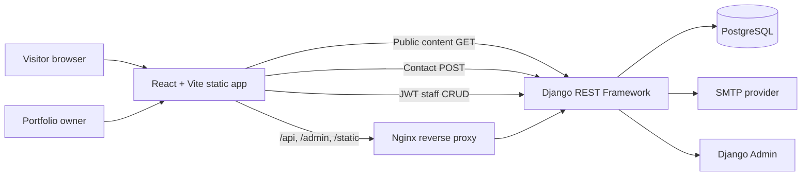

# Personal Portfolio Platform

A responsive React portfolio, staff dashboard, and Django REST API for Shumet Yeserah. The supplied CV is included in the public download assets. Dates, GPA, technical details for projects, LinkedIn profile URL, and testimonial copy remain editable where they were not provided.

## Architecture



The frontend is a static single-page application. Nginx serves it and proxies the API, Django admin, and static admin assets to the backend. Django REST Framework owns validation, publication visibility, staff permissions, rate limits, contact persistence, and notification email. PostgreSQL is the production database; SQLite is available for local API tests when `DATABASE_URL` is omitted.

## Repository Layout

```text
portfolio/
├── frontend/
│   ├── src/
│   │   ├── PortfolioEntry.tsx
│   │   ├── PortfolioPage.tsx
│   │   ├── AdminDashboard.tsx
│   │   ├── portfolio.css
│   │   ├── admin.css
│   │   └── global.css
│   ├── public/                 # Add cv.pdf and public assets here
│   ├── Dockerfile
│   ├── nginx.conf
│   └── package.json
├── backend/
│   ├── config/                 # Django settings, ASGI/WSGI, root URLs
│   ├── portfolio/              # Models, serializers, permissions, API, admin, seed command, tests
│   ├── requirements.txt
│   └── Dockerfile
├── docker-compose.yml
└── README.md
```

## Frontend Component Hierarchy

`PortfolioEntry` selects the public page or staff dashboard from the path. `PortfolioPage` reads the profile, projects, skills, education, experience, certifications, achievements, services, and testimonials from the API. `AdminDashboard` owns JWT login/refresh, overview analytics, CRUD for all of those public content types, profile/CV/social links, and the contact inbox.

Open `/dashboard` and sign in with a Django staff account to manage the site. Profile settings include your portrait URL and CV URL; project and testimonial records also accept image URLs. Use links to images/files that you own and that are publicly readable over HTTPS. The website does not use a stock portrait; until you set a portrait URL, it shows your initials. Contact messages post to the API. Saved public content appears on the next page load.

## Database Schema

| Entity             | Main fields                                                                                            | Purpose                 |
| ------------------ | ------------------------------------------------------------------------------------------------------ | ----------------------- |
| `PortfolioProfile` | name, title, biography, objective, email, phone, Telegram URL, LinkedIn contact email, social links    | Public identity         |
| `Project`          | title, slug, summary, description, image, tech stack JSON, category, links, featured, published, order | Work showcase           |
| `Skill`            | name, category, proficiency, published, order                                                          | Skill groups and levels |
| `Education`        | institution, degree, years, GPA, description, achievements JSON                                        | Academic history        |
| `Certification`    | name, issuer, issue date, credential URL                                                               | Credentials             |
| `Experience`       | organization, role, dates, current flag, summary, achievements JSON                                    | Work history            |
| `Achievement`      | title, description, date, URL                                                                          | Awards and milestones   |
| `Service`          | title, description, icon key                                                                           | Services offered        |
| `Testimonial`      | author, role, organization, quote, avatar URL                                                          | Recommendations         |
| `ContactMessage`   | name, email, subject, message, read state, created timestamp                                           | Private contact inbox   |

Ordered content shares publication, ordering, and audit timestamps. Contact records are never publicly listed; anonymous access only permits message creation. Staff can view and manage them.

## API Endpoints

All routes are rooted at `/api/v1/`. Public list/detail routes only return published records. Content mutation, contact inbox reads, and analytics require staff authentication.

| Method                   | Endpoint                                                                                                        | Access                     |
| ------------------------ | --------------------------------------------------------------------------------------------------------------- | -------------------------- |
| `GET`                    | `/profile/`                                                                                                     | Public read                |
| `GET`, staff CRUD        | `/projects/`, `/projects/{slug}/`                                                                               | Public read; staff write   |
| `GET`, staff CRUD        | `/skills/`, `/education/`, `/certifications/`, `/experience/`, `/achievements/`, `/services/`, `/testimonials/` | Public read; staff write   |
| `POST`                   | `/contact-messages/`                                                                                            | Public, 5 submissions/hour |
| `GET`, `PATCH`, `DELETE` | `/contact-messages/`, `/contact-messages/{id}/`                                                                 | Staff only                 |
| `POST`                   | `/auth/token/`, `/auth/token/refresh/`                                                                          | Staff JWT login/refresh    |
| `GET`                    | `/admin/stats/`                                                                                                 | Staff only                 |
| `GET`                    | `/admin/`                                                                                                       | Django admin session       |

DRF pagination is enabled (12 items/page), project search is enabled, and skills filter on `category`. Contact validation checks email/lengths and includes a honeypot. Email notification uses SMTP settings; local development logs outgoing emails to the console.

## Responsive, Theme, and Accessibility Strategy

The UI begins with a single-column mobile layout and progressively becomes two/three-column at wider sizes. Navigation becomes a compact disclosure on small screens; project cards, editor forms, tables, and the admin sidebar adapt without fixed viewport widths. Semantic landmarks/headings, descriptive images, labelled controls, visible keyboard focus, skip navigation, live form status, and `prefers-reduced-motion` support are included.

Dark is the portfolio's initial theme. The toggle stores the preference in `localStorage`; CSS custom properties drive the dark/light palettes. The admin dashboard uses a separate light operational palette.

## Performance and Security

- Vite production builds, minification, lazy-loaded project images, explicit image aspect ratios, and pagination for API content.
- Fonts are preconnected. Portfolio images and CV links are supplied by the owner through public URLs; keep the URLs on trusted HTTPS hosts.
- Database connection reuse, publication filtering, contact throttling, honeypot validation, server-side serializers, short-lived JWT access tokens with rotation/blacklisting, and staff-only write permissions.
- Deployment secrets come from environment variables. PostgreSQL is only available on the Compose network. Nginx proxies API/admin/static paths and serves SPA fallbacks.
- Terminate HTTPS at a public ingress, pass `X-Forwarded-Proto`, and enable secure cookies and `SECURE_SSL_REDIRECT` in production.

## Run Locally

Frontend:

```powershell
cd frontend
Copy-Item .env.example .env.local
npm install
npm run dev
```

Backend, in a second terminal:

```powershell
cd backend
py -3.12 -m venv .venv
Copy-Item .env.example .env
.\.venv\Scripts\python.exe -m pip install -r requirements.txt
.\.venv\Scripts\python.exe manage.py migrate
.\.venv\Scripts\python.exe manage.py seed_portfolio
.\.venv\Scripts\python.exe manage.py createsuperuser
.\.venv\Scripts\python.exe manage.py runserver
```

The frontend runs at `http://localhost:5173`, the API at `http://localhost:8000/api/v1/`, and Django admin at `http://localhost:8000/admin/`. If using an existing Python environment, activate it and substitute its Python executable for `.venv`.

## Docker Deployment

Copy `.env.example` to `.env`, set a unique `DJANGO_SECRET_KEY` and `POSTGRES_PASSWORD`, add SMTP values and the public hostname, then run:

```powershell
docker compose up --build
```

Open `http://localhost:8080` for the site and `http://localhost:8080/admin/` for Django admin. For public hosting, route DNS and HTTPS ingress to the frontend service, enable secure-cookie/redirect settings, and back up PostgreSQL. Create the first staff account with `docker compose exec api python manage.py createsuperuser`.

## Free Deployment Guide

This setup keeps the React website on Vercel, the Django API on Render, and the PostgreSQL database on Supabase. It can run on their free offerings, but it is a hobby/demo setup rather than reliable production hosting: free web services may sleep, free databases may pause after inactivity, and the limits/prices can change. Check the providers' current terms before deploying:

- [Render free instance limitations](https://render.com/docs/free)
- [Supabase plans and quotas](https://supabase.com/pricing)
- [Vercel Git deployments](https://vercel.com/docs/git)

### 1. Prepare the content and source repository

1. Put this project in a GitHub repository. Do not commit `.env`, passwords, database URLs, or Django secret keys.
   If this folder is not already connected to a repository, run these commands from the project root after creating an empty GitHub repository:

   ```powershell
   git init
   git add .
   git commit -m "Prepare portfolio for deployment"
   git branch -M main
   git remote add origin https://github.com/YOUR_USERNAME/YOUR_REPOSITORY.git
   git push -u origin main
   ```

   The root `.gitignore` excludes local environments, databases, and `.env` files. Check `git status` before pushing and never force-add secrets.
2. Replace `frontend/public/cv.pdf` with your current CV if you want to keep the built-in copy.
3. Have a portrait image and project screenshots ready. The admin stores public image/file URLs rather than uploading binary files to Django. Host your own files somewhere that gives a direct HTTPS URL (for example, an object-storage bucket) and paste those URLs into the dashboard after deployment.
4. The site currently has starter portfolio records. Review and edit them in the dashboard before sharing the site.

### 2. Create a free PostgreSQL database

1. Create a Supabase account and a new project.
2. In the project dashboard, open **Connect** and copy a PostgreSQL connection string that is reachable from Render (use the session pooler if the direct database host is not reachable from your Render region).
3. Keep the full URI private. It will be added to Render as `DATABASE_URL`. The URI must include the database password and SSL mode as supplied by Supabase.
4. Save the database password securely; do not put it into this repository.

Supabase currently documents a 500 MB database quota and automatic pausing of free projects after a period of inactivity. Visit the Supabase dashboard periodically and keep an independent backup of important content.

### 3. Deploy the Django API to Render

1. In Render, choose **New → Web Service**, connect the GitHub repository, and select the free instance.
2. Set the **Root Directory** to `backend`.
3. Set **Build Command** to:

   ```sh
   pip install -r requirements.txt && python manage.py collectstatic --noinput
   ```

4. Set **Start Command** to:

   ```sh
   python manage.py migrate --noinput && python manage.py seed_portfolio && gunicorn config.wsgi:application --bind 0.0.0.0:$PORT
   ```

5. Add these environment variables in Render. Replace example hostnames with the actual service/site URLs:

   | Key | Value |
   | --- | --- |
   | `DATABASE_URL` | Supabase PostgreSQL URI |
   | `DJANGO_SECRET_KEY` | A newly generated, long random secret |
   | `DJANGO_DEBUG` | `false` |
   | `DJANGO_ALLOWED_HOSTS` | `your-api-name.onrender.com` (hostname only) |
   | `CORS_ALLOWED_ORIGINS` | `https://your-site-name.vercel.app` |
   | `CSRF_TRUSTED_ORIGINS` | `https://your-api-name.onrender.com,https://your-site-name.vercel.app` |
   | `SECURE_SSL_REDIRECT` | `true` |
   | `SESSION_COOKIE_SECURE` | `true` |
   | `CSRF_COOKIE_SECURE` | `true` |

   You can generate a secret locally with `python -c "import secrets; print(secrets.token_urlsafe(64))"`; use the Python executable available on your computer. Never reuse the example development key.
6. Deploy. Wait for Render to show the service as **Live**, then open `https://your-api-name.onrender.com/api/v1/profile/`. A JSON response confirms that the API is reachable.
7. In the Render service's Shell, run `python manage.py createsuperuser` and follow the prompts. This staff account signs in to the portfolio dashboard.

Contact form messages are still saved in the admin inbox without SMTP. To receive email notifications, configure the SMTP variables documented in `backend/.env.example`; email is optional.

### 4. Deploy the React site to Vercel

1. In Vercel, choose **Add New → Project**, import the same GitHub repository, and select the free Hobby option if it is available for your account.
2. Set **Root Directory** to `frontend`. Keep the detected Vite framework settings, with build command `npm run build` and output directory `dist`.
3. Add the build environment variable `VITE_API_URL` with value `https://your-api-name.onrender.com/api/v1` (no trailing slash).
4. Deploy and wait for the deployment to complete. The included `frontend/vercel.json` routes `/dashboard` to the React app.
5. Open the Vercel URL, then visit `https://your-site-name.vercel.app/dashboard` and sign in with the superuser created on Render.

### 5. Personalize and verify the live site

1. In `/dashboard`, open **Profile & CV**. Update your name, headline, biography, objective, contact details, social links, portrait URL, and CV URL. Use a direct, publicly readable HTTPS URL for hosted images or files. The default CV link is `/cv.pdf`.
2. Update project descriptions and replace project image URLs with screenshots of your own work. Add, edit, publish, unpublish, or delete skills, education, experience, certifications, achievements, services, and testimonials in their respective admin sections.
3. In another browser tab, reload the public site and confirm the new values, image links, CV, project links, and contact form. Test the admin sign-in and sign-out.
4. Keep the Supabase database password and Render Django secret private. Free Render services spin down when idle, so the first page/API request after inactivity may take about a minute. Supabase can pause its free database after inactivity as well.

For local editing and testing, see [Run Locally](#run-locally). The Docker setup above is for self-hosting; it is not itself a free public hosting service.
